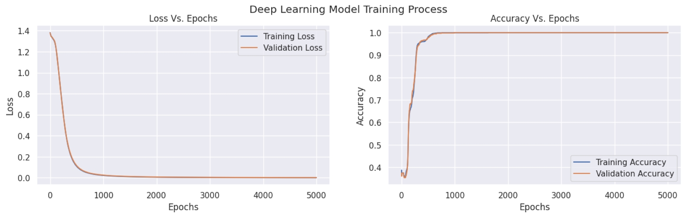
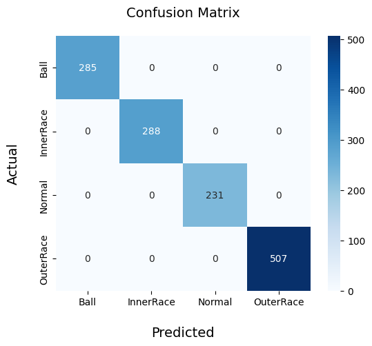

# Serving a Pytorch model as a RESTful API by FastAPI
This repository is a demonstration on how you can develop a simple endpoint using FastAPI to serve a Pytorch model as an independent service. The process is almost the same for any other intelligent model.

## 1. Introduction

Intelligent methods are developed to be used and Jupyter/Colab notebooks are far from being ideal for the production stage. On the other hand, deployment through **Model as a Service** or [MasS](https://medium.com/@pearcenjordan/what-is-maas-unlock-the-power-of-model-as-a-service-27ebbcaefce6) is one of the favourite options. The main aim of this repository is to deploy a Pytorch model as an individual service, using FastAPI. We start from structurizing a benchmark bearing fault diagnosis dataset; then, we design, implement, train and evaluate a deep learning model to diagnose the bearing. Next is to develop a RESTful API using FastAPI to serve the model. Last but not least, we deploy the whole application on [render.com](https://render.com/).

## 2. Data

Data is the critical ingridient of every data-driven solution. I use the  Case Western Reverse University [bearing dataset](https://engineering.case.edu/bearingdatacenter); this dataset includes signals from both drive-end and fan-end bearings but we focus on the drive-end signals in this implementation. Similar to other benchmark datasets, the raw data is presented as super long signals (e.g. 122281-points long). Hence, the starting point is to divide these raw signals into 2048-points signals with a hop-lenght of 2048. Metadata (load, health state and fault severity) are also extracted in this stage. To achieve smoother convergence, time series need to be scaled; to do so, every signal is subtracted from its mean and divided by its standard deviation, as illustrated in the following equation:

$\widetilde{x} = \frac{x - \mu}{\sigma}$

where $\widetilde{x}$ is the scaled time serie, $x$ is the raw time serie, $\mu$ is the mean of the $x$ and $\sigma$ is its standard deviation. In the [scaler.py]() file, the implementation of the scaling operation can be found.

Next, is to split the dataset into train and test subsets, using a 70:30 ratio. It worth mentioning that as the scaling transorm in this implementation is instance-specific, it is safe to first scale the dataset and then split into train/test subsets.

## 3. Model

The problem we aim to solve is an example of time series classification and Convolutional Neural Networks (CNNs) are one of the favorite model types to engage such problem. I use a one-dimensional CNN consisting of a wide kernel convolutional layer, followed by an average pooling layer and a linear layer, as illustrated in the following figure.


Although this model looks too simple at the first glance, it achieves 100% accuracy over the hold-out test set. You can see the training curves and the confusion matrix at the following figures.





For details on how the training is done, you can check the [training notebook]().

## 4. API

Application Programming Interfaces (APIs for short) enable seamless communication between different software applications. They serve as bridges, allowing developers to access and integrate functionalities from other services, thereby enhancing the capabilities of their own applications. In this implementation, I aim to serve the model as an individual API developed by [FastAPI](https://fastapi.tiangolo.com/); a minimalistic API development Python package. Using FastAPI, enables you to develop lightweight web services, quickly. Moreover, its minimalistic nature aligns with the [microservices](https://www.youtube.com/watch?v=CdBtNQZH8a4&list=PLOspHqNVtKAC-_ZAGresP-i0okHe5FjcJ&index=8&pp=iAQB) architecture, perfectly.

As the name implies, API development using FastAPI is fast and easy; in fact, using only 41 lines of code available at [api.py](), we are able to develop an [RESTful](https://www.youtube.com/watch?v=lsMQRaeKNDk&list=PLOspHqNVtKAC-_ZAGresP-i0okHe5FjcJ&index=29&pp=iAQB) API to serve our model. Let's discuss the code in detail; once the essential imports are done, I first check if a GPU is available, using the snippet below:

```python
if torch.cuda.is_available():
    device = torch.device("cuda:0")

else:
    device = torch.device("cpu")
```

Next, is to import the saved model from the previous section. To do so, we first initialize an instance of our model and then import and set the state of the model as a dictionary object. Don't forget to set the model to the evaluation mode, as we aim to use it only for inference. 

```python
model = Classifier().to(device)

importing_path = r'assets/'
model.load_state_dict(torch.load(importing_path + 'lightCNN_timeClassifier_Pytorch_preprocessing_state_dict.pth', map_location = device))
model.eval()
```

During the training of the model, we have encoded health states of the bearing to integers(0 for ball problem, 1 for inner race fault, 2 for normal bearings and 3 for outer race fault); to decode the model predictions, I stored this encoding as json file in [decoder.json](). To load this, we use the code snippet below:


```python
with open(importing_path + 'decoder.json', 'rt') as r:
    decoder = json.load(r)
```

As we plan to use a POST endpoint to serve our model, we need to give an idea of the data this endpoint is supposed to recieve. In the code snippet below, we estalish that our endpoint is provided with a json object that must have a "record" key, whose corresponding value is a list of folat numbers.

```python
class Item(BaseModel):
    record: list[float]
```

Finally comes the instantiation of FastAPI class and developing the endpoint itself; once we have done the instantiation, we use the ```@app.post("/batch_predict/")``` decorator to specify both the endpoint and REST method. Next, we declare that this endpoint recieves a list of objects from ```Item``` class, declared earlier. using ```x = torch.tensor([item.record for item in items]).reshape(-1, 2048)``` we store the list of records into a ```torch.tensor()``` and in ```x_scaled = torch.autograd.Variable(scaler(x).reshape(-1, 1, 2048).float()).to(device)``` we scale them using the [scaler.py]() function. Afterwards, in ```preds = torch.softmax(model(x_scaled), 1)``` we extract the corresponding prediction to each record and apply the [softmax operator](https://en.wikipedia.org/wiki/Softmax_function) to extract probability logits for each class. For each signal, we provide two pieces of information: most probable class (under the ```"Prediction"``` key) and probability logits (uner the ```"Probabilities"``` key); this is done by ```analysis = [{"Prediction": decoder[str(i.index(max(i)))], "Probabilities": dict(zip(decoder.values(), i))} for i in preds.tolist()]```. It is useful keep an eye on the inference time, therefore using the ```st = time.time()``` expression in the begining and the ```et = time.time()``` starting time and ending time are stored; we then multiply their subtraction by 1000 to get the inference time in mSec and include it in the response under the ```"Execution Time"``` key, alongside the ```"Analysis"``` key that stores the results from model inference.

```python
app = FastAPI()

@app.post("/batch_predict/")
def batch_predict(items: list[Item]):
    st = time.time()
    x = torch.tensor([item.record for item in items]).reshape(-1, 2048)
    x_scaled = torch.autograd.Variable(scaler(x).reshape(-1, 1, 2048).float()).to(device)
    preds = torch.softmax(model(x_scaled), 1)
    
    analysis = [{"Prediction": decoder[str(i.index(max(i)))], "Probabilities": dict(zip(decoder.values(), i))} for i in preds.tolist()]

    et = time.time()

    return {"Analysis": analysis, "Execution Time": 1000 * (et - st)}
```
Simplest command to fire up the FastAPI application is to type ```fastapi dev api.py```. Once it is up and running, it can be accessed using the serving address (default is http://127.0.0.1:8000/); don't forget to add the 'batch_predict/' at the end of the serving address. In [test.py](), a simple code snippet is prepared to call the API using samples belonging to the hold-out test set and check its performance. Moreover, using to the experiment routine available at [API_performance_test.py](), means (over 10 iterations) of execution time (merely the inference time at server) and the delivery time (full process time of an API call) for different sample lenghts are summarized in table below:

| Lenght of records | Mean of Execution Time (mSec) | Mean of Delivery Time (mSec) |
|:-----------------:|:-----------------------------:|:----------------------------:|
|         1         |            1.194501           |           9.664512           |
|         5         |            2.588010           |           20.841908          |
|         10        |            4.323363           |           32.100201          |
|         25        |            7.867980           |           77.776027          |
|         50        |           16.154027           |          150.619459          |
|        100        |           28.503513           |          274.795508          |
|        150        |           42.668891           |          388.662696          |
|        200        |           58.588600           |          532.502770          |

## 5. Deployment
A web application being served on your computer, is one and only useful to you yourself; hence, we need to have this deployed on the internet so it can be accessible to others to. Easiest and cheapest way to do so, is to use a [PaaS](https://www.youtube.com/watch?v=QAbqJzd0PEE&list=PLOspHqNVtKAC-_ZAGresP-i0okHe5FjcJ&index=5&pp=iAQB) provider to take care of all the dirty work for you and only focus on the deployment itself. My choice is [Render](https://render.com/), particularly for the free tire they provide, generously; although it is extremely limited from the resources perspective. You can check this [video](https://www.youtube.com/watch?v=MDQ_JNZjKU0) for a detailed walkthrough about FastAPI application deployment using Render. Live version of this application should be accessible through https://simpledeploy-erxy.onrender.com/batch_predict/. A table similar to the previous one, but for the online instance of the application is summarized in the talbe below:

| Lenght of records | Mean of Execution Time (mSec) | Mean of Delivery Time (mSec) |
|:-----------------:|:-----------------------------:|:----------------------------:|
|         1         |           42.664576           |          649.108887          |
|         5         |           55.691361           |          695.322013          |
|         10        |           25.902724           |          814.575458          |
|         25        |           198.714757          |          1546.012044         |
|         50        |           296.859717          |          2232.221818         |
|        100        |           544.858074          |          2509.584689         |
|        150        |           864.624906          |          3194.585657         |
|        200        |          1014.331365          |          4353.009653         |